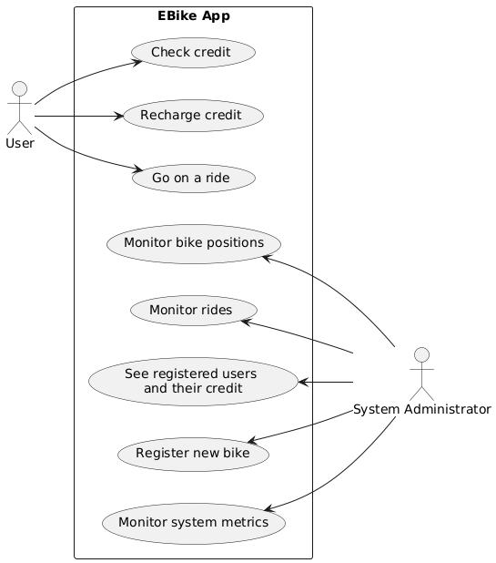
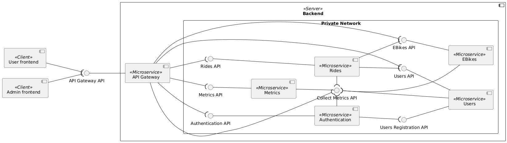
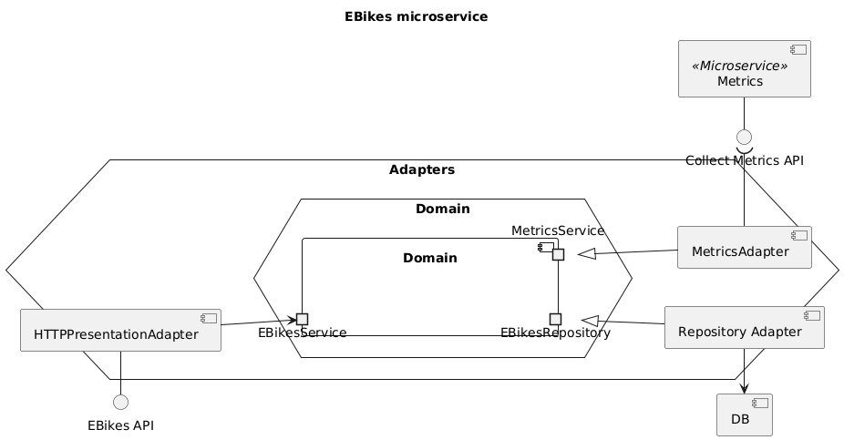
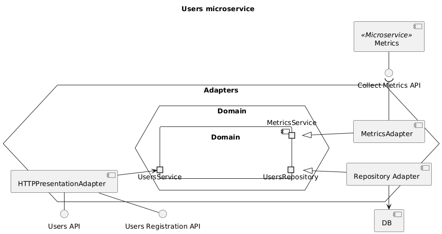
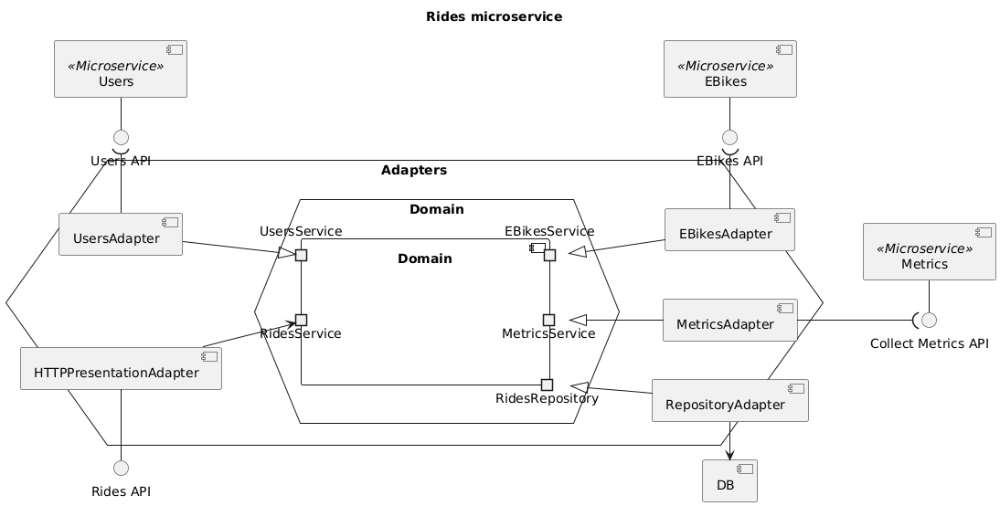

# Assignment #02 - Software Architecture and Platforms - a.y. 2024-2025

**Description** 

Consider the "EBike application" seen in the first assignment. The objective of the second assignment is to design and develop a distributed version based on microservices and microservices patterns - as discussed in modules 2.X and in Lab Notes about microservices patterns, and adopting DDD as reference method for the analysis and development stage.

In particular:

- A knowledge crunching process must be enacted so to gather and represent architectural drivers, defining (following DDD) a proper Ubiquitous Language, structured around a domain model, and using it to define artifacts useful to both define requirements and quality attributes (user stories, use cases, domain stories, quality attribute scenarios), as well as bounded contexts and context map.
- Moving from strategical to tactical design, a model-driven design should be adopted, applying -- when useful -- DDD domain model pattern.
- The architecture should be based on microservices and hexagonal/ports & adapters/clean architecture style, for the design of the individual service.
- The architecture should integrate microservices patterns that are considered relevant, given the case study, considering the different examples and categories seen in the course:
  - Application-level patterns 
  - Testing patterns
  - Deployment patterns
  - Runtime Configuration pattern
  - Observabilty Patterns
- A strategy for validating the proposed architecture should be devised and enacted, given the requirements and the quality attributes defined in the analysis stage.  
    
**Deliverable**

A zipped folder ``Assignment-02-<Surname>`` including a maven-based or gradle-based project, with sources and the report in PDF. The deliverable can be submitted using a link on the course web site.

**Deadline** 

November 29, 2024 - 9:00 AM
 
## Requirements

### User Stories

|As a| I want to|so that I can|
|----|----------|-------------|
|user|go on a ride with a rented bike|leave it wherever i want|
|user|check my credit|understand if it needs to be recharged|
|user|recharge my credit|go on a ride|
|system administrator|see the current location of every bike|check if was left too far|
|system administrator|see which users are currently riding a bike|spot any anomaly if present|
|system administrator|see all the registered users and their credit|spot any anomaly if present|
|system administrator|add new bikes to the system|increase the number of bikes in the future|

### Use cases

#### Scenarios

- Go on a ride:
    1. The user chooses an available bike and selects "Start ride"
    1. The user can see his credits updating while he's riding
    1. The user selects "End ride"

- Check credit:
    1. The user sees his credit right in the home screen

- Recharge credit:
    1. The user selects a "recharge credit" button
    1. The user inserts how much credits he wants to deposit
    1. The user confirms

- Add new bike:
    1. The system administrator chooses an id for the new bike and confirms
    1. The system checks that the id is valid, and if it's not it fails the operation
    1. The system register the new bike with the given valid id

- See registered users and their credit:
    1. The system administrator interface shows always every registered user alongside his credit

- Monitor rides
    1. The system administrator interface shows user usernames that are on a ride alongside the bike their riding

- Monitor bike positons
    1. The system administrator interface shows a graphical representation of the bike locations on a 2D space

### Business requirements
- The credit of the user must be decreased by 1 unit every second

## Analisys

### Bounded contexts
Given the requirements multiple bounded contexts were identified:

- System administrator interactions
- User interactions
- Users management
- E-bikes management
- Rides management
- User authentication (emerged due to the need of storing users credit)

### Ubiquitous language

|Word|Definition|Synonyms|
|----|----------|--------|
|User|The actual app customer one which rents bikes to ride|Customer|
|Username|A text chosen by the user which uniquely identifies him inside the system|User id|
|Admin|An employee of the organization whose responsibility is to monitor the system and to take actions to let the system work as expected|System administrator|
|E-bike|An electric bike which can be rented by the users|Ebike, bike|
|E-bike location|The geographical location of the bike|E-bike position|
|Ride|The rental of a bike from a user which aims to use it to move from one place to another||
|Credit|An internal currency that the users exchange with bikes rental time||
|Recharge credit|Process executed by the user by which his credit is increased by the requested amount||
|Register new ebike|An action taken by the admin which has the outcome of making the system aware of a new bike which can then be rented|Create new ebike|
|Monitor ebikes/rides|Admin's capability to check the location of each bike and which users are riding them||
|Authentication|Process by which the user provides enough data to the system to identify him|Login|

### Domain model

## Design

The system is designed follwing a microservice architecture.

### API Gateway
The API Gateway microservice is the only service exposed to the internet.

It has the responsibility to relay the client requests to the appropriate services.

#### A choice regarding security
Given the fact that the API Gateway is the only exposed access point it will be resposible for validating (through the Authentication Server) every request before relaying it.

This allows to keep the token validation logic centralized letting every other microservice assume that the requests they receive are authenticated.

This is by far not a much secure solution but for the purpose of this project it allows to reduce overall complexity.

### EBikes and Users microservices

The EBikes microservice and the Users microservice are both built follwing the hexagonal architecture.

They don't depend on any other microservice.

### Rides microservice

The Rides microservice is built follwing the hexagonal architecture.

It depends on both the other microservices (EBikes and Users).

### Authentication Server

The Authentication Server is responsible for generating JSON Web Tokens (JWT) and validating them.
